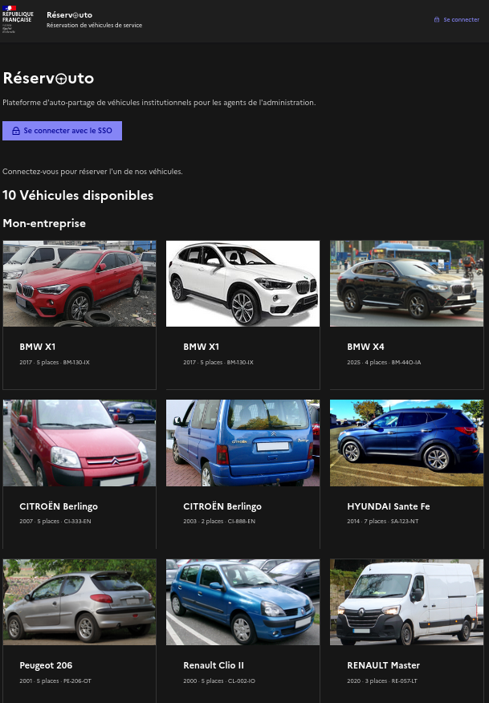
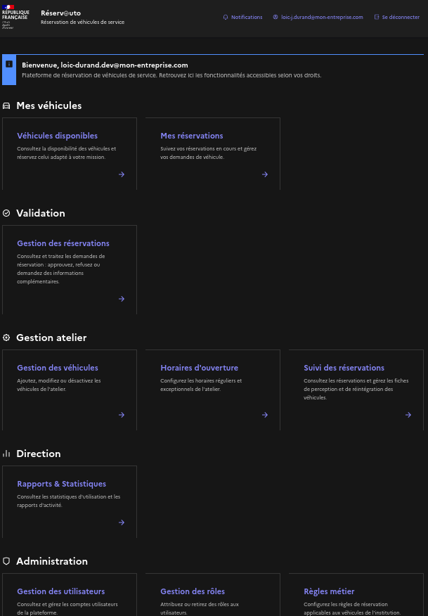
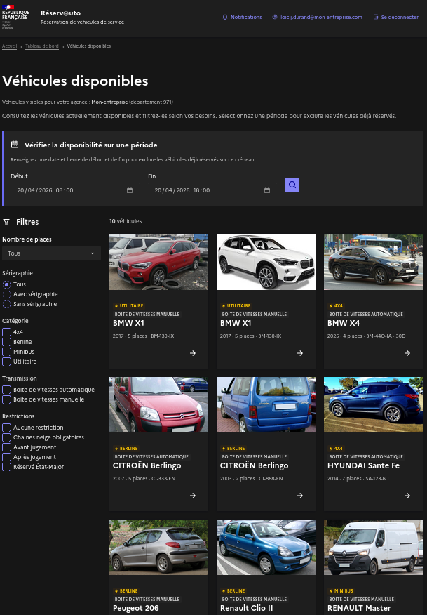
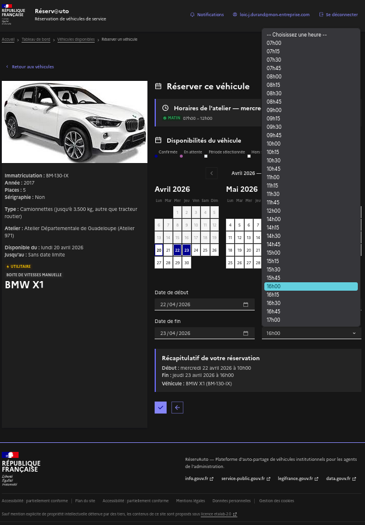
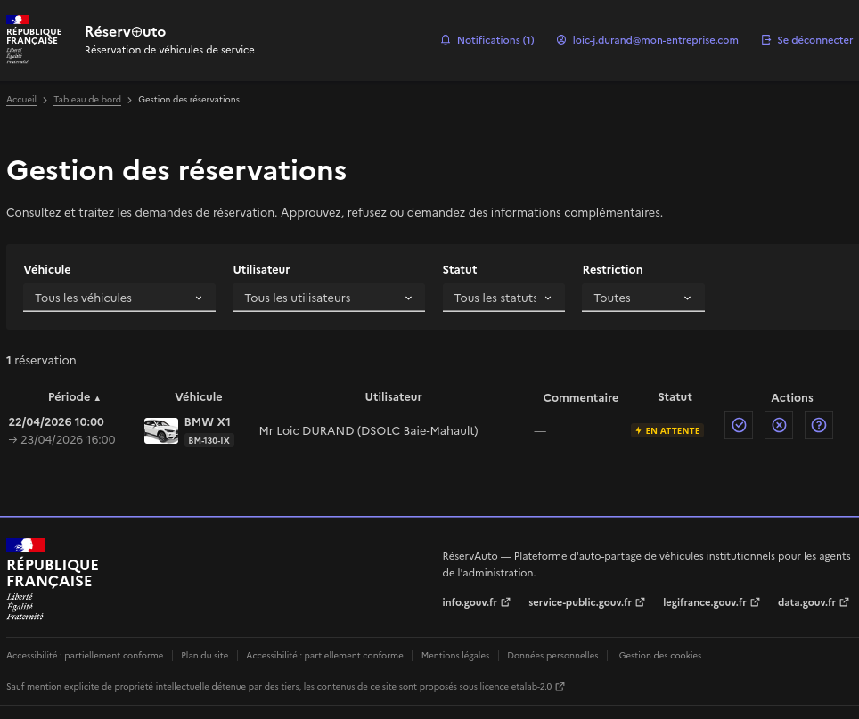
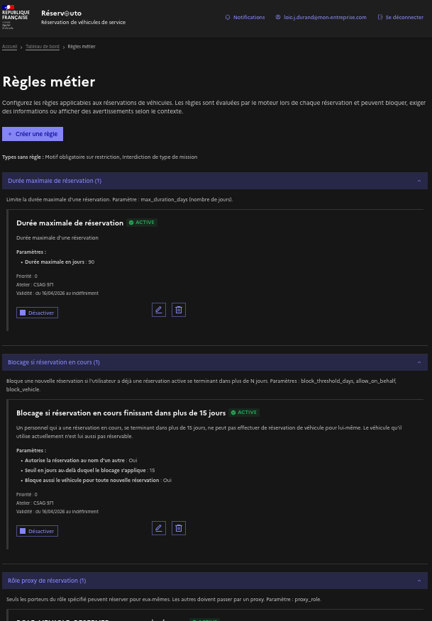
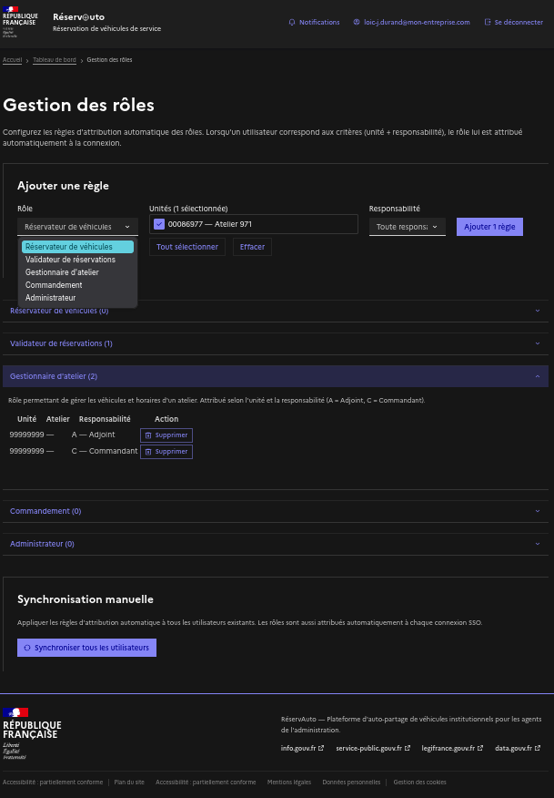

<div align="center">

# RéservAuto

**Plateforme d'auto-partage de véhicules institutionnels**

*Gestion de flotte, réservation, et moteur de règles métier pour les services publics*

[](#stack-technique)
[](#stack-technique)
[](#stack-technique)

</div>

---

## Présentation

RéservAuto est une application interne destinée aux services publics. Elle permet de mettre à disposition des véhicules institutionnels sous forme d'auto-partage : chaque agent peut consulter les véhicules disponibles, réserver celui adapté à sa mission, et suivre ses réservations en cours.

Le projet couvre un périmètre fonctionnel large — authentification SSO, gestion de rôles cumulatifs avec auto-attribution, filtrage multi-agences, moteur de règles métier dynamique, notifications et envoi d'emails — le tout implémenté avec un backend Rust performant et un frontend React moderne.

> **Code source disponible sur demande pour les recruteurs ou partenaires potentiels.**
> Me contacter via [GitHub](https://github.com/loicdurand) ou LinkedIn.

---

## Captures d'écran

### Page d'accueil — Véhicules disponibles



### Tableau de bord - Chacune de ces sections n'est visible que des utilisateurs ayant le rôle approprié



### Réservation d'un véhicule





### Gestion des réservations



### Administration — Règles métier



### Administration — Utilisateurs et rôles



---

## Architecture

```
┌──────────────────────────────────────────────────────────────────┐
│                        Navigateur                               │
│  React 19 · TypeScript · Vite 8 · DSFR (@codegouvfr/react-dsfr) │
│  AuthContext + JWT (HttpOnly cookie) · Proxy Vite (dev)          │
└──────────────┬───────────────────────────────────────────────────┘
               │ HTTPS (CORS)
               ▼
┌──────────────────────────────────────────────────────────────────┐
│                    API REST — Axum 0.7                           │
│  ┌────────────┐  ┌──────────────────┐  ┌─────────────────────┐ │
│  │  Auth SSO   │  │  Contrôleurs REST │  │  Middleware rôles   │ │
│  │  OAuth2     │  │  (Utoipa/OpenAPI) │  │  (guards cumulatifs)│ │
│  └──────┬─────┘  └────────┬─────────┘  └──────────┬──────────┘ │
│         │                 │                        │            │
│         ▼                 ▼                        ▼            │
│  ┌──────────────────────────────────────────────────────────┐   │
│  │              Couche Application                           │   │
│  │  Services métier · Moteur de règles (RuleEngine)         │   │
│  │  NotificationService · RoleAutoAssignService              │   │
│  └──────────────────────────┬───────────────────────────────┘   │
│                             │                                  │
│                             ▼                                  │
│  ┌──────────────────────────────────────────────────────────┐   │
│  │           Couche Infrastructure                           │   │
│  │  Diesel 2.2 (MySQL) · Repositories · MailService         │   │
│  │  (SMTP / API SOAP du SSO)                                │   │
│  └──────────────────────────┬───────────────────────────────┘   │
└─────────────────────────────┼──────────────────────────────────┘
                              │
                              ▼
                    ┌──────────────────┐
                    │    MySQL 8        │
                    │  (migrations      │
                    │   Diesel)         │
                    └──────────────────┘
                              │
              ┌───────────────┴───────────────┐
              ▼                               ▼
     ┌────────────────┐              ┌────────────────┐
     │  SSO OAuth2     │              │  Serveur SMTP   │
     │  (auth + mail)  │              │  (Mailcrab/dev) │
     └────────────────┘              └────────────────┘
```

### Architecture en couches (backend)

Le backend suit une architecture en couches stricte :

| Couche | Répertoire | Responsabilité |
|--------|-----------|----------------|
| **API** | `api/` | Handlers HTTP, middleware de permissions, documentation OpenAPI |
| **Application** | `application/` | Logique métier, services, moteur de règles |
| **Domain** | `domain/` | Modèles du domaine purs, validation, erreurs |
| **Infrastructure** | `infrastructure/` | Persistance (Diesel/MySQL), envoi d'emails, clients externes |

Les dépendances vont de haut en bas — la couche domaine ne dépend de rien, l'infrastructure implémente les interfaces du domaine.

---

## Stack technique

| Couche | Technologie |
|--------|-------------|
| **Backend** | Rust (edition 2021), Axum 0.7, Tokio, Diesel 2.2 (MySQL) |
| **Documentation API** | Utoipa 5 + Swagger UI (OpenAPI 3.1) |
| **Frontend** | React 19, TypeScript, Vite 8, SCSS |
| **UI** | DSFR — Système de Design de l'État (`@codegouvfr/react-dsfr`) |
| **Base de données** | MySQL 8, migrations Diesel |
| **Authentification** | SSO OAuth2 + JWT (HS256, cookie HttpOnly) |
| **Email** | SMTP (dev / Mailcrab) ou API SOAP du SSO (prod) |

---

## Défis techniques

### Moteur de règles métier dynamique

Le cœur du projet est un moteur de règles entièrement configurable en base de données, sans re-déploiement. 7 types de règles sont interprétés par le `RuleEngine` via un système de hooks :

```
Règle en base (business_rules)
  → type (enum: max_reservation_duration, active_reservation_block, …)
  → paramètres JSON (max_duration_days, block_threshold_days, proxy_role, …)
  → scope optionnel (atelier, période de validité)
      │
      ▼
  RuleEngine :: evaluate(hook, context)
      │
      ├─ before_create_reservation → Block | Allow
      ├─ get_required_fields       → RequireField (champs dynamiques)
      ├─ get_disclaimers           → ShowDisclaimer (avertissements)
      └─ filter_visible_vehicles   → filtre par rôle + restriction
```

**Ce que cela permet** : une institution peut ajouter une règle "Durée maximale de réservation : 14 jours" scoped à un atelier spécifique et valide uniquement l'été — sans une seule ligne de code à modifier. Le formulaire de réservation s'adapte dynamiquement (champs requis, avertissements, blocages).

### Scoping multi-agences avec filtrage automatique

Chaque atelier appartient à une agence (ex : "police", "impots", "mairie"). À la connexion SSO, l'agence de l'utilisateur est déduite de son domaine email via un pattern regex configurable. Les véhicules sont filtrés automatiquement : un agent ne voit que les véhicules de son agence et de son département, plus les véhicules universels.

```
Utilisateur "agent@police.interieur.gouv.fr"
  → EMAIL_AGENCY_PATTERN = "^([a-z0-9-]+)\\."
  → agence extraite : "police"
  → département extrait du champ SSO "dptUnite"
  → véhicules visibles : ateliers "police" du même département + universels
```

### Système de rôles cumulatifs avec auto-attribution

6 rôles système cumulatifs (User → Reserver → Validator → WorkshopManager → Executive → Admin) + rôles dynamiques personnalisables par l'institution. L'auto-attribution se déclenche à chaque connexion SSO : les règles en base correspondent aux attributs SSO de l'utilisateur (code unité, responsabilité). Le système gère aussi les **attributions en attente** — un admin peut attribuer un rôle à un utilisateur pas encore inscrit, qui sera appliqué automatiquement à sa première connexion.

### Formulaire de réservation adaptatif

Le frontend interroge `GET /reservations/rules` avant d'afficher le formulaire. Selon les règles actives pour le véhicule choisi, le formulaire :
- Affiche ou masque des champs (motif, type de mission, tiers bénéficiaire)
- Présente des avertissements obligatoires (disclaimers à acquitter)
- Bloque la soumission si une règle le requiert

### Notifications et emails non bloquants

Chaque événement (création, validation, changement de statut) génère une notification in-app ET un email. L'envoi d'email est non bloquant : un échec SMTP ou SSO est loggé en warning, l'action principale (réservation, etc.) se poursuit normalement. Deux implémentations : `SmtpMailService` (lettre, développement avec Mailcrab) et `SsoMailService` (reqwest, production via API SOAP).

---

## Fonctionnalités

- Consultation des véhicules disponibles et de leurs caractéristiques
- Gestion des images de véhicules (illustration principale, galerie)
- Réservation de véhicules pour une mission ou une période donnée
- Suivi des missions et réservations en cours
- Gestion des horaires d'ouverture des remises (réguliers et exceptionnels)
- Moteur de règles métier configurables (7 types, paramètres JSON, scope atelier/temporel)
- Formulaire de réservation adaptatif (champs dynamiques, avertissements, blocages)
- Notifications en app (création, validation, changement de statut) + emails
- Système d'alertes (maintenance, échéances réglementaires, anomalies)
- Authentification SSO sécurisée (OAuth2) + JWT en cookie HttpOnly
- 6 rôles cumulatifs + rôles dynamiques + auto-attribution à la connexion
- Attributions de rôles en attente pour les utilisateurs pas encore inscrits
- Scoping par agence et département (filtrage automatique des véhicules)
- Configuration institutionnelle sans forker (timezone, code pays, pattern email, etc.)
- Documentation API interactive (Swagger UI / OpenAPI 3.1)
- Recherche d'utilisateurs par mail ou nom d'affichage

---

## Règles métier — Types disponibles

| Type | Hook | Effet |
|------|------|-------|
| `max_reservation_duration` | `before_create_reservation` | Bloque si la durée dépasse la limite |
| `active_reservation_block` | `before_create_reservation` | Bloque si une réservation en cours se termine dans plus de N jours |
| `reservation_proxy_role` | `before_create_reservation` | Exige un rôle spécifique pour réserver au nom d'un tiers |
| `restriction_visibility` | `filter_visible_vehicles` | Restreint la visibilité d'un véhicule selon le rôle |
| `restriction_disclaimer` | `get_disclaimers` | Affiche un avertissement obligatoire |
| `restriction_requires_motive` | `get_required_fields` | Exige un motif ou un type de mission |
| `restriction_prohibits_mission_type` | `before_create_reservation` | Interdit certains types de mission |

Chaque règle peut être scoped à un atelier spécifique et/ou à une période de validité.

---

## Configuration institutionnelle

L'application est conçue pour être adaptée sans forker. Cinq variables d'environnement suffisent à l'adapter aux besoins d'une institution :

| Variable | Défaut | Description |
|----------|--------|-------------|
| `DEFAULT_COUNTRY_CODE` | `FR` | Code pays par défaut (ISO 3166-1 alpha-2) |
| `DEFAULT_TIMEZONE` | `Europe/Paris` | Timezone IANA par défaut |
| `UNIT_CODE_PATTERN` | `^\d{8}$` | Pattern regex pour la validation des codes unité |
| `RESPONSABILITE_VALUES` | `A,C` | Valeurs de responsabilité autorisées |
| `EMAIL_AGENCY_PATTERN` | `^([a-z0-9-]+)\.` | Pattern regex pour extraire l'agence du domaine email |

---

## À propos

Ce projet a été conçu et développé comme une application complète de gestion de flotte institutionnelle, en mettant l'accent sur :

- **La robustesse du backend Rust** — typage fort, gestion d'erreurs exhaustive, performances
- **L'extensibilité du moteur de règles** — ajouter un comportement métier sans modifier le code
- **La sécurité** — SSO OAuth2, JWT HttpOnly, guards de rôles cumulatifs, filtrage par agence
- **L'accessibilité et le design** — DSFR, responsive, conformité RGAA
- **L'architecture propre** — séparation domain/application/infrastructure, modèles métier purs

Développé avec Rust (Axum + Diesel), React 19, TypeScript et le Système de Design de l'État français.

---

*Code source disponible sur demande pour les recruteurs ou partenaires potentiels — [me contacter](https://github.com/loicduranddev)*
